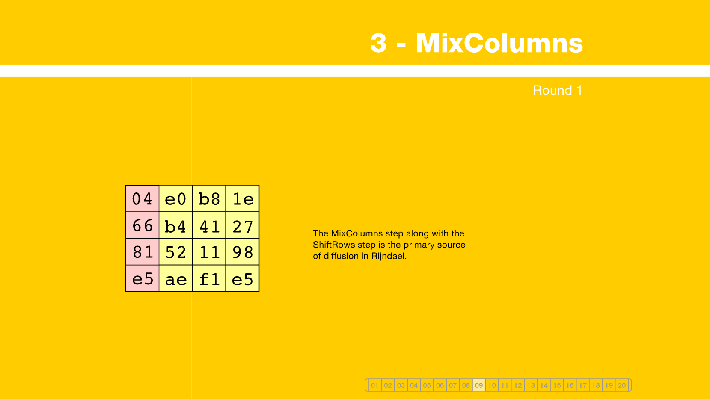
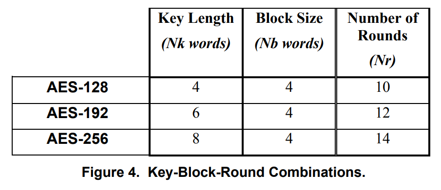

#AES implementation
### Advanced Encryption Algorithm (Rijndael)

- [x] two-way process of encryption and decryption with the use of a key
- [x] a sequence of characters serves as the key
- [x] encrypting data to safely store it
#### AES standards: 
- key lengths: 128, 192, 256 bits
- constant block size: 128 bits

#### sources:
- https://formaestudio.com/rijndaelinspector/archivos/Rijndael_Animation_v4_eng-html5.html
- https://crypto.stackexchange.com/questions/2402/how-to-solve-mixcolumns

